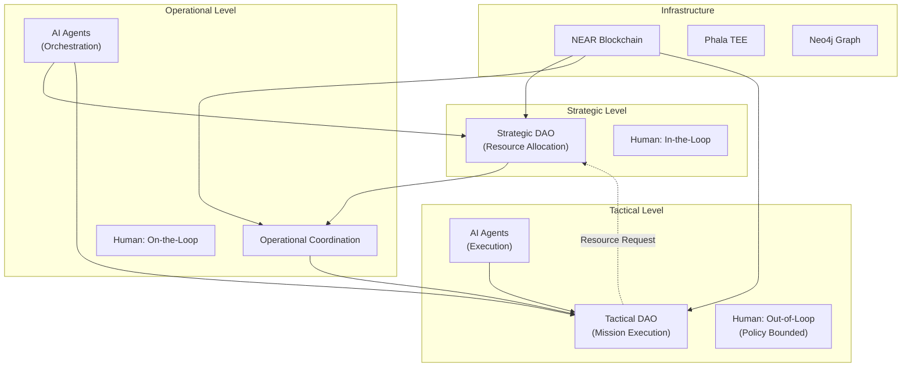

<objective>
Write the Methodology section describing BASTION's architecture and design decisions with supporting diagrams.

Purpose: Explain HOW BASTION addresses the gaps identified in Background, with justification for key architectural choices. This is the "systems integration novelty" contribution - showing how components work together.

Output: Methodology section (~6-8 pages, 2500-3500 words) plus system architecture diagram
</objective>

<execution_context>
@~/.claude/get-shit-done/workflows/execute-plan.md
@~/.claude/get-shit-done/templates/summary.md
</execution_context>

<context>
@.planning/PROJECT.md
@.planning/phases/13-research-whitepaper/13-CONTEXT.md
@.planning/phases/13-research-whitepaper/13-RESEARCH.md
@.planning/STATE.md (for accumulated decisions from implementation)
</context>

<tasks>

<task type="auto">
  <name>Task 1: Write Methodology - Design Principles and Architecture Overview</name>
  <files>docs/whitepaper/03-methodology.md</files>
  <action>
Write the first part of Methodology section (~3-4 pages, 1200-1600 words).

**Section Structure:**

## 3. Methodology

### 3.1 Design Principles

**Decentralization for Resilience** (~2-3 paragraphs)
- No single point of failure
- Operations continue if nodes lost
- Coalition partners don't depend on single authority
- Connect to C2 vulnerability identified in Background

**Transparency for Trust** (~2-3 paragraphs)
- All decisions recorded immutably
- Audit trail across organizational boundaries
- Accountability without centralized oversight
- Connect to transparency/accountability gap from Background

**AI Augmentation for Speed** (~2-3 paragraphs)
- Accelerate decision cycles
- Consistent policy application
- Human authority preserved at critical points
- Connect to JADC2 tempo goals

**Policy Compliance by Design** (~2-3 paragraphs)
- Smart contracts encode rules and constraints
- National caveats enforced automatically
- Autonomy bounded by policy
- Connect to coalition coordination challenges

### 3.2 Architecture Overview

**Three-Tier DAO Structure** (~4-5 paragraphs)
Describe BASTION's multi-level architecture:

1. **Strategic-Level DAO**
   - Resource allocation and policy decisions
   - Coalition membership and voting weights
   - Long-term objective setting
   - Analogous to strategic command level

2. **Operational-Level DAO**
   - Campaign coordination
   - AI agent orchestration
   - Resource-to-objective mapping
   - Bridge between strategic intent and tactical execution

3. **Tactical-Level DAO**
   - Mission-specific decisions
   - Asset coordination
   - Target identification and effects delivery
   - Real-time execution with policy constraints

**Inter-DAO Communication** (~2-3 paragraphs)
- How DAOs link and coordinate
- Automatic proposal generation (tactical to strategic)
- Resource state monitoring
- Reference MVP demonstration from proposal

**Reference to Architecture Diagram:**
"Figure 1 illustrates the three-tier architecture..."
(Actual figure created in Task 2)

**Style notes:**
- Connect every design choice to a gap from Background
- Use active voice
- Conceptual descriptions only (no code, no API details)
- [CITATION NEEDED] for any external references
  </action>
  <verify>Design principles articulated and connected to Background gaps, three-tier architecture described clearly</verify>
  <done>First half of methodology establishes architectural foundation with gap-to-solution mapping</done>
</task>

<task type="auto">
  <name>Task 2: Create system architecture diagram</name>
  <files>docs/whitepaper/figures/system-architecture.md</files>
  <action>
Create a Mermaid diagram showing BASTION's high-level architecture. Per CONTEXT.md, this should be 1-2 high-level diagrams only.

Create file with:

1. **Mermaid source code** for the diagram

2. **Diagram should show:**
   - Three DAOs (Strategic, Operational, Tactical)
   - AI Agent layer interacting with all three
   - Blockchain layer (NEAR Protocol)
   - Key connections:
     - Strategic DAO <-> Operational coordination
     - Operational <-> Tactical execution
     - AI agents augmenting each level
     - Blockchain securing all transactions
   - Human authority positions indicated at each level

3. **Use flowchart style** with clear hierarchy:

4. **Figure caption text:**
"Figure 1: BASTION High-Level Architecture. The three-tier DAO structure connects strategic resource allocation to tactical execution through operational AI agent coordination. Arrows indicate decision flow direction; dashed lines represent feedback loops (e.g., tactical resource expenditure triggering strategic replenishment requests). Human authority positions are indicated at each level."

5. **Export instructions:**
Note that for final document, this Mermaid source should be exported to PNG at 300 DPI.
  </action>
  <verify>Mermaid diagram source created showing three-tier architecture with human authority positions</verify>
  <done>System architecture diagram ready for export and inclusion in paper</done>
</task>

<task type="auto">
  <name>Task 3: Write Methodology - Key Design Decisions and Technology Choices</name>
  <files>docs/whitepaper/03-methodology.md</files>
  <action>
Append to the Methodology section (~3-4 pages, 1200-1600 words).

**Continue Section Structure:**

### 3.3 Key Design Decisions

Create a design decisions table (per CONTEXT.md - explain choices with justification):

| Decision | Alternatives Considered | Rationale |
|----------|------------------------|-----------|
| NEAR Protocol for blockchain | Ethereum, Solana, private blockchain | Developer-friendly contracts, performance, DID support |
| DAO-based governance | Traditional RBAC, centralized authority | Decentralized trust, coalition-compatible |
| AI agent augmentation | Full automation, human-only | Balance speed with accountability |
| Smart contract policy encoding | Runtime policy evaluation | Immutable enforcement, audit trail |
| Three-tier architecture | Flat DAO, hierarchical C2 | Maps to military levels of warfare |

**Expand each decision** (~2 paragraphs each):

**NEAR Protocol Selection**
- Why blockchain (not traditional database)
- Why NEAR specifically (conceptual benefits only)
- Do NOT include implementation details per CONTEXT.md

**AI Agent Architecture**
- Single-responsibility agents (per agentic-ai-guide principles)
- Agent types: facilitators, analysts, executors
- Trust calibration and graduated autonomy
- Reference NEAR AI Governance Framework phases

**Security Architecture** (~3-4 paragraphs)
Per CONTEXT.md - requirements-driven approach:
- Zero trust principles
- ABAC (Attribute-Based Access Control) for coalition environments
- Post-quantum cryptography considerations
- Brief technology survey without implementation details

### 3.4 Human Authority Integration

**Autonomy Levels by Decision Type** (~3-4 paragraphs)
- Which decisions require which authority position
- How autonomy constraints are encoded
- Trust earned through performance
- Connect to three authority positions from Background

**Strike Authorization as Special Case** (~2 paragraphs)
- Always requires human approval (in-the-loop)
- DAO voting for lethal decisions
- Audit trail and accountability
- This is central to thesis on human control

### 3.5 Component Integration

**Novel Integration Points** (~3-4 paragraphs)
This is the "systems integration novelty" contribution:
- DAO + AI agents (not done before)
- Blockchain + military C2 (gap from literature)
- Multi-level coordination (strategic-operational-tactical)
- Policy encoding + autonomous execution

**Cross-reference to Results:**
"The following section demonstrates these architectural components in an end-to-end scenario..."

**Style notes:**
- Focus on WHY choices were made, not HOW they're implemented
- Connect decisions back to research question
- Reference Background gaps explicitly
- [CITATION NEEDED] for any claims
  </action>
  <verify>Design decisions table present with rationale, security architecture covered at requirements level, human authority integration explained</verify>
  <done>Methodology complete with architecture, decisions, and integration points documented</done>
</task>

</tasks>

<verification>
- [ ] Design principles connect to Background gaps
- [ ] Three-tier DAO architecture clearly described
- [ ] System architecture diagram created (Mermaid source)
- [ ] Design decisions table with alternatives and rationale
- [ ] Security architecture covered at requirements level
- [ ] Human authority integration explained
- [ ] Strike authorization special case addressed
- [ ] Novel integration points highlighted
- [ ] Cross-references to Background and Results
</verification>

<success_criteria>
- Reader understands BASTION's architecture and why each component exists
- Gap-to-solution mapping is explicit
- Systems integration novelty clearly articulated
- No implementation details (conceptual only per CONTEXT.md)
- Ready to demonstrate architecture in Results section
</success_criteria>

<output>
After completion, create `.planning/phases/13-research-whitepaper/13-04-SUMMARY.md`
</output>
