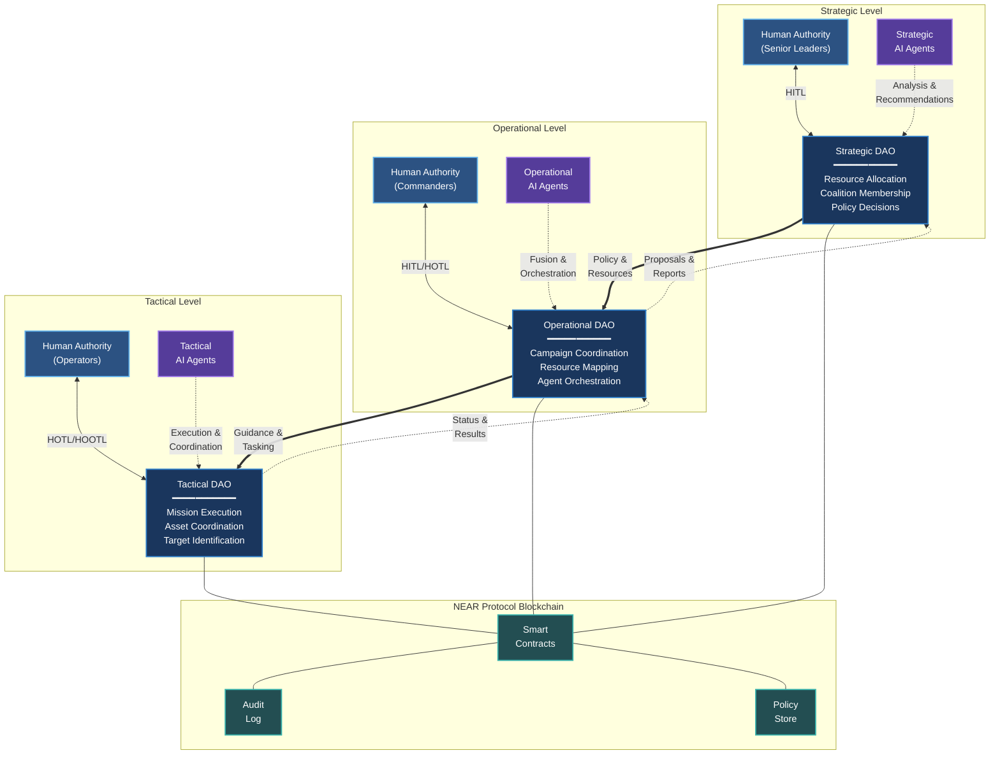

# Figure 1: BASTION High-Level Architecture

## Mermaid Source

## Figure Caption

**Figure 1: BASTION High-Level Architecture.** The three-tier DAO structure connects strategic resource allocation to tactical execution through operational AI agent coordination. Solid arrows indicate decision flow direction (strategic guidance flowing downward); dashed lines represent feedback loops (e.g., tactical resource expenditure triggering strategic replenishment requests, mission results informing operational assessment). Human authority positions are indicated at each level: Human-in-the-Loop (HITL) for strategic decisions, HITL or Human-on-the-Loop (HOTL) at operational level based on decision type, and HOTL or Human-out-of-the-Loop (HOOTL) at tactical level for pre-approved mission types. AI agents augment decision-making at all levels without replacing human authority for consequential decisions. The NEAR Protocol blockchain secures all transactions through smart contracts, maintaining immutable audit logs and enforcing encoded policy constraints.

## Architecture Elements

### Three-Tier DAO Structure

1. **Strategic DAO** - Governs coalition-level decisions: resource allocation across theaters, coalition membership and voting weights, and long-term policy decisions. All strategic decisions require Human-in-the-Loop (HITL) approval.

2. **Operational DAO** - Bridges strategic intent and tactical execution: coordinates campaigns, orchestrates AI agent activities, and maps resources to objectives. Authority position varies by decision type (HITL for significant decisions, HOTL for routine coordination).

3. **Tactical DAO** - Manages mission-specific decisions: asset coordination, target identification, and effects delivery within policy constraints. Pre-approved mission types may execute with HOTL or HOOTL authority; high-consequence decisions always require human approval.

### AI Agent Layer

AI agents augment decision-making at each level:
- **Strategic Agents**: Analyze long-term trends, assess resource requirements, recommend policy adjustments
- **Operational Agents**: Fuse intelligence, assess campaign progress, orchestrate multi-agent coordination
- **Tactical Agents**: Execute mission coordination, provide real-time recommendations, handle routine actions within policy bounds

### Blockchain Infrastructure

NEAR Protocol provides the secure foundation:
- **Smart Contracts**: Encode governance rules and policy constraints
- **Audit Log**: Immutable record of all decisions and actions
- **Policy Store**: Machine-readable policy encoding for automatic compliance

### Human Authority Positions

The diagram indicates graduated authority requirements:
- **HITL (Human-in-the-Loop)**: Human must approve each action before execution
- **HOTL (Human-on-the-Loop)**: System acts autonomously while human monitors and can intervene
- **HOOTL (Human-out-of-the-Loop)**: System acts fully autonomously within policy constraints (tactical routine actions only)

## Export Instructions

For final document inclusion, export this Mermaid diagram to PNG format:

1. Use Mermaid CLI: `mmdc -i system-architecture.md -o system-architecture.png -w 1200 -H 900`
2. Or Mermaid Live Editor: https://mermaid.live/
3. Export at 300 DPI for print quality
4. Recommended dimensions: 1200x900 pixels minimum for readability

## Cross-References

- Architecture description: See Section 3.2 (Architecture Overview) in `03-methodology.md`
- Design principles justifying architecture: See Section 3.1 (Design Principles) in `03-methodology.md`
- Background on levels of warfare: See Section 2.5 in `02-background-military.md`
- Human authority positions background: See Section 2.9 in `02-background-ai.md`
